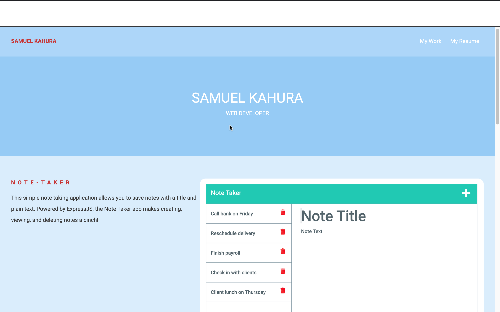
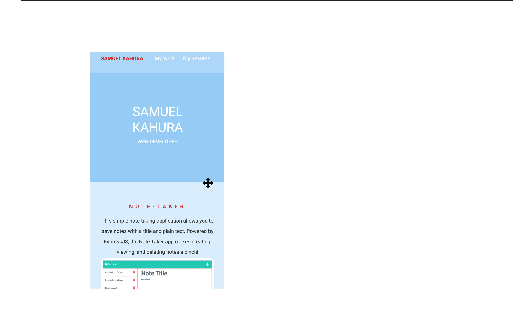

# Updated-Portfolio

# screenshot

# Hey 👋, I'm Samuel kahura!

# Glad your here

I'm currently learning Web Development 🕸️ I'm a passionate learner who's always willing to learn and work across technologies and domains 💡. I love to explore new technologies and leverage them to solve real-life problems. This website serves as an online portfolio to showcase my web presence, résumé, story, & featured projects.

## Getting Started

Talking about Personal Stuffs:
🛠 I’m currently working on Javascript, Css, and Html .

🚀 I’m currently learning Full Stack Development.

👨🏻‍💻 Most of my projects are available on Github.

👾 Fun fact: Equals is Not Always Equal in Javascript.

## Built With

My personal portfolio _Samuelkahura Portfolio_ which features some of my github projects as well as my resume and technical skills.
HTML

🎨 Styled : Css with easy to customize colors

📱 Fully Responsive

# Acceptance Criteria

\*WHEN you load my portfolio.

\*THEN you are presented with my name up in the header, links and sections about me, my work, and how to contact me.

\*WHEN you click one of the links in the navigation.

\*THEN it takes you to the corresponding section.

\*WHEN you click the link to the section about my work.

\*THEN it takes you to a section that holders my work.

\*WHEN you resize the page or view the site on various screens and devices.

\*THEN you are presented with a responsive layout that adapts to my viewport.

# Link to Website

https://snk-99.github.io/Portfolio/
